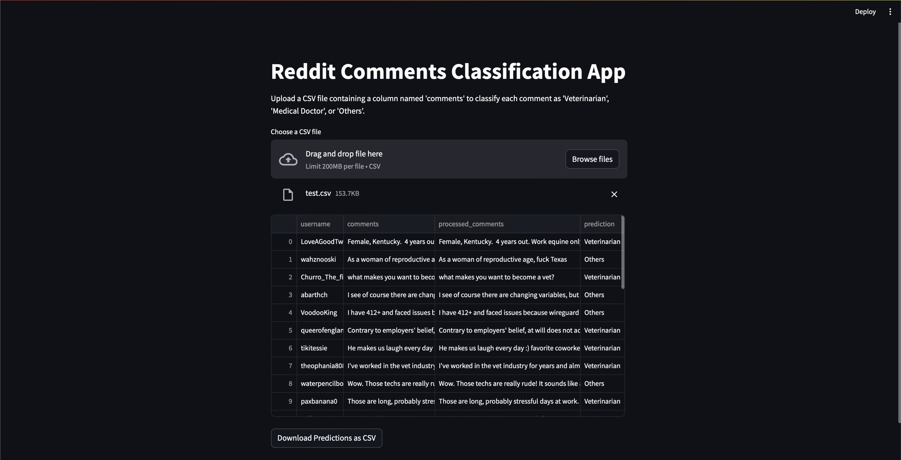

# Reddit Comment Classification App

## Overview

This project is a Streamlit web application designed to classify Reddit comments into three categories: "Veterinarian", "Medical Doctor", or "Others". The classification is performed using a fine-tuned BERT (Bidirectional Encoder Representations from Transformers) model, showcasing the practical application of fine-tuning a language model for a specific text classification task.


## Motivation

With the abundance of user-generated content on platforms like Reddit, automated text classification can provide valuable insights and streamline information retrieval. This project aims to demonstrate the use of advanced NLP techniques to accurately categorize comments, which can be useful in various applications such as sentiment analysis, content moderation, and personalized content delivery.

## Key Features

- **Fine-Tuned BERT Model**: The core of the application is a BERT model that has been fine-tuned on a custom dataset of Reddit comments. This process involves adapting a pre-trained LLM to perform a specific task by training it further on a labeled dataset.
- **Streamlit Web Application**: A user-friendly web interface built with Streamlit allows users to input comments and receive classification results in real-time.
- **Balanced Dataset**: The training dataset consists of an equal number of samples for each category to ensure balanced learning and accurate predictions.
- **Hyperparameter Tuning**: Optuna, an optimization framework, was used to find the best hyperparameters for training, enhancing the model's performance.
- **Mixed Precision Training**: Leveraging mixed precision training techniques to efficiently use GPU memory and accelerate the training process.

## Tools and Libraries

- **Transformers**: Utilized the `transformers` library by Hugging Face for model implementation and fine-tuning.
- **Optuna**: Used for hyperparameter optimization to improve model performance.
- **Streamlit**: Developed the web application interface for easy interaction with the model.
- **Pandas**: Employed for data manipulation and preprocessing.
- **Scikit-Learn**: Utilized for label encoding and evaluation metrics.
- **PyTorch**: The deep learning framework used for model training and evaluation.

## Setup Instructions

### Prerequisites

- Python 3

### Clone the Repository

1. Open your terminal or command prompt.
2. Clone the repository using the following command:

    ```bash
    git clone https://github.com/ChidiNdego/reddit-comments-classifier.git
    ```

3. Navigate to the project directory:

    ```bash
    cd reddit-comments-classifier
    ```

### Set Up the Virtual Environment

1. Create a virtual environment:

    ```bash
    python3 -m venv myenv
    ```

2. Activate the virtual environment:

    - On macOS/Linux:

        ```bash
        source myenv/bin/activate
        ```

    - On Windows:

        ```bash
        myenv\Scripts\activate
        ```

3. Install the required packages:

    ```bash
    pip install -r requirements.txt
    ```

### Run the Streamlit App

1. Ensure the virtual environment is activated.
2. Run the Streamlit app:

    ```bash
    streamlit run app.py
    ```

3. Open your web browser and navigate to the URL provided by Streamlit (usually `http://localhost:8501`).

## Usage

1. Upload a CSV file containing a column named 'comments'.
2. The app will preprocess and classify each comment.
3. View the classified results in the app.
4. Download the classified results as a CSV file.



## Future Work

- Expand Categories: Incorporate additional categories to make the classification more comprehensive.
- Model Improvements: Experiment with other transformer models such as RoBERTa or GPT-3 for potentially better performance.
- Deployment: Deploy the application on a cloud platform like AWS, GCP, or Heroku for wider accessibility.
- User Feedback: Implement a feedback loop to continuously improve the model based on user inputs.

## Conclusion

This project demonstrates the application of fine-tuning a large language model for a specific task and showcases the integration of various modern tools and techniques in natural language processing. It's a testament to the potential of AI in automating and enhancing text classification tasks, making it a valuable project for potential recruiters and collaborators.

Feel free to explore the code, provide feedback, and contribute to further improving the application. For any inquiries, please reach out through the contacts provided below.

## Contacts
- [LinkedIn](https://www.linkedin.com/in/chidindego)
- [Email](mailto:chidindego@gmail.com)
- [Twitter](https://twitter.com/SoyChidi)